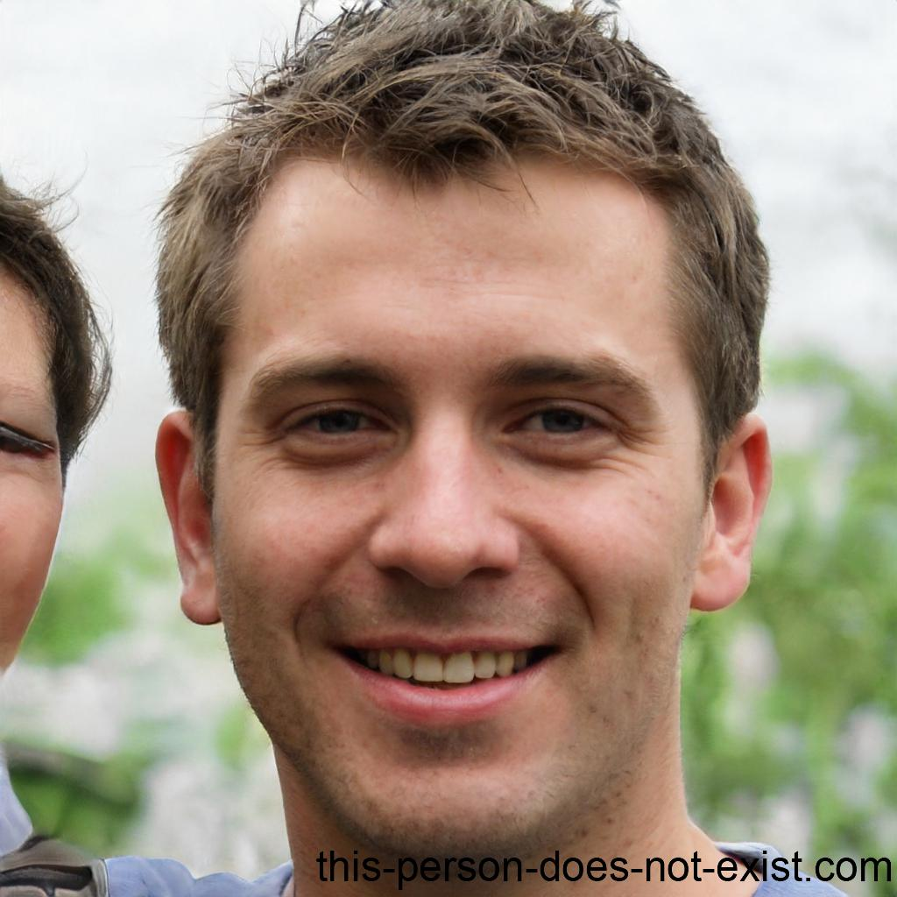

# Exercice : Créer un CV
Sur base de vos données personnelles ou de celles ci-dessous : 
1. Choisissez votre fichier de départ en fonction de vos affinités
1. Intégrez les données en HTML
1. Ajoutez-y du style pour vous l'approprier (en CSS ou avec Bootstrap)

# Curriculum Vitae

## Informations Personnelles
- Nom : Martin
- Prénom : Thomas
- Date de Naissance : 15 mars 1992 (31 ans)
- Adresse : 456, Avenue Virtuelle, 1000 Bruxelles, Belgique
- Téléphone : +32 2 34 56 78
- Email : thomas.martin@email.com

## Formations

- 2010-2014 : Bachelier en Informatique Appliquée, Haute École de Technologie de Liège
- 2014-2016 : Master en Développement Web, Université de Bruxelles

## Expériences Professionnelles

- Avril 2016 - Présent : Développeur Front-End, Société TechVision, Bruxelles
  - Conception et développement d'interfaces utilisateur pour des applications web et mobiles en utilisant HTML, CSS et JavaScript.
  - Collaboration étroite avec les designers pour transformer des maquettes en interfaces interactives et conviviales.
  - Expérience dans la mise en œuvre de projets Agile, avec des sprints et des réunions de planification et de rétrospective.
  - Utilisation de frameworks tels que React et Vue.js pour créer des expériences utilisateur dynamiques et réactives.
  - Intégration de services RESTful et utilisation de Git pour le contrôle de version.
- Juin 2015 - Mars 2016 : Stagiaire en Développement Web, Startup WebCraft, Liège
  - Assistance dans la création d'une application web responsive utilisant les dernières technologies front-end.
  - Participation à l'optimisation des performances du site et à l'assurance de sa compatibilité avec différents navigateurs.
  - Contribution à la mise en place d'une méthodologie de développement Agile au sein de l'équipe.

## Compétences

- Développement Front-End (HTML, CSS, JavaScript)
- Frameworks et CMS : Bootstrap, jQuery, Wordpress
- Conception d'Interfaces Utilisateur (UI)
- Méthodologies Agile (Scrum)
- Contrôle de Version (Git)

## Langues
- Français (courant), 
- Anglais (avancé), 
- Néerlandais (notions)

## Centres d'Intérêt
- Programmation créative
- Musique : Pratique de la guitare et de la composition musicale
- Randonnée : Exploration des magnifiques paysages naturels en Belgique et ailleurs